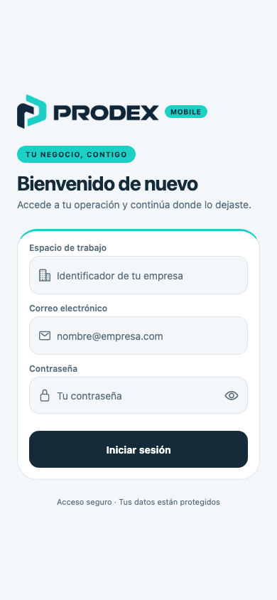
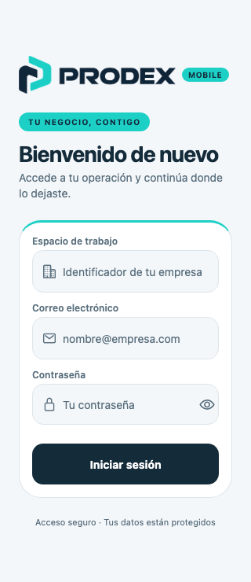

# PRODEX · Auditoría de paleta oficial

## Referencia y alcance

Referencia autoritativa: los tres PNG entregados por el usuario. Se copiaron sin recolorear, redibujar ni modificar sus píxeles; sus SHA-256 coinciden con los originales. Se consultó la documentación requerida de [Expo SDK 57](https://docs.expo.dev/versions/v57.0.0/) antes de editar.

El fondo opaco dominante del app icon es `#142B3A` (763475 píxeles). El cyan sólido más frecuente del icono y del símbolo es `#1DD0C6`; el logo contiene variaciones de navy próximas a `#102639`. Los derivados claros y oscuros son adaptaciones para interfaz, no colores exactos adicionales extraídos de los PNG.

La auditoría encontró branding verde en `brand`, `brandDark`, `brandSoft`, texto, canvas y bordes; azul y morado decorativos en métodos de pago; fondos de producto multicolor; un icono antiguo; una P tipográfica en Dashboard; overlays verdosos; y controles nativos que heredaban colores del sistema.

## Paleta final y tokens

| Uso | Tokens | Color |
| --- | --- | --- |
| Navy principal / texto / CTA | navy, brand, ink | `#142B3A` |
| Navy oscuro | navyDark, brandDark, onAccent | `#102639` |
| Cyan oficial | cyan, accent | `#1DD0C6` |
| Cyan oscuro para texto y foco | cyanDark, accentDark | `#087D78` |
| Cyan suave | cyanSoft, accentSoft, brandSoft | `#E2F8F6` |
| Fondo | canvas | `#F4F7FA` |
| Superficie / texto inverso | surface, white | `#FFFFFF` |
| Bordes | line | `#DCE5EB` |
| Texto secundario | inkMuted | `#586E7C` |
| Texto secundario sobre navy | inkOnDark | `#C4D4DE` |
| Éxito | success / successSoft | `#23764B` / `#E8F5ED` |
| Advertencia | amber / amberSoft | `#986407` / `#FFF3D6` |
| Error / acción destructiva | red / redSoft | `#B43F48` / `#FCE7E7` |
| Fondo de modal | backdrop | `rgba(16, 38, 57, 0.46)` |

Se modificaron `brand`, `brandDark`, `brandSoft`, `ink`, `inkMuted`, `canvas`, `line`, `shadows.card.shadowColor` y `semantic.positive/info/inventory`. Los aliases de compatibilidad `blue`, `blueSoft`, `teal`, `tealSoft`, `purple` y `purpleSoft` se conservaron para no romper contratos existentes, pero ahora apuntan a la familia cyan. Se añadieron los tokens explícitos navy/cyan, accent/onAccent, success, inkOnDark y backdrop. Los tokens ámbar y rojo se conservaron para estados semánticos. El contrato de catálogo `product.tone` no cambió; el componente ya no lo usa para decorar productos.

Reglas: CTA principales navy con texto blanco; selecciones y acentos cyan con texto navy; enlaces/foco cyan oscuro; superficies blancas y fondos fríos suaves. Verde únicamente para éxito, caja abierta, conciliación exacta o crecimiento positivo. Ámbar para alertas, pendientes y salida/cierre de efectivo; rojo para errores, impago o acciones destructivas. No se incorporaron degradados, blur ni glassmorphism.

## Pantallas y componentes auditados

| Pantalla | Corrección visual |
| --- | --- |
| Login | Logo horizontal oficial, badge cyan, borde superior cyan en formulario, CTA navy, foco coherente en los tres campos. |
| Dashboard | Símbolo oficial, hero navy oscuro con detalle cyan, gráfico con día activo cyan, accesos navy/cyan, indicadores de crecimiento semánticos. |
| POS | Categorías cyan, botón escanear cyan, imágenes de producto sobre cyan suave, botones de agregar y cobrar cyan/navy, banner informativo coherente. |
| Checkout | Métodos de pago de una misma familia cromática, resumen con acento cyan, selecciones accesibles, éxito de validación separado, selector de clientes y overlays navy. |
| Ventas y factura | Header, filtros y tabs cyan; badges pagado/pendiente/error semánticos; textos, cards y acciones de factura heredan navy del theme. El HTML de factura entregado por backend no se modifica. |
| Inventario | Header/filtros/tabs cyan; cards y textos neutros; ámbar/rojo conservados solo para bajo stock/sin stock. |
| Clientes | Header con regreso cyan suave, avatares cyan, directorio/detalle/editor con texto navy, campos y carga coherentes. |
| Reportes | Rangos cyan, hero suave con borde cyan y barras cyan. |
| Caja | Totales con acento cyan; caja abierta y conciliación exacta verdes semánticos; apertura/cierre y movimientos con paleta común; switches cyan. |
| Más | Header e iconos cyan, cuenta y acciones navy; cerrar sesión permanece rojo semántico. |
| Escáner | Header navy sólido, marco cyan, texto inverso y feedback del theme. |
| Compartidos | BrandSignature, AuthLoading, AppHeader, tabs, QuickAction, CategoryChip, StatusBadge, SearchField, EmptyState, cards y bottom sheets alineados. Cursores, selección y refresh nativos con colores explícitos. |

## Assets y configuración

- `assets/icon.png`: app icon oficial; también referencia de favicon web.
- `assets/prodex-symbol.png`: símbolo oficial para Dashboard, splash y foreground adaptativo Android sobre blanco.
- `assets/prodex-logo.png`: logo horizontal oficial para Login y carga inicial.
- `app.json`: solo se cambiaron las referencias/colores visuales; se retiraron las referencias a background y monochrome antiguos del icono adaptativo.
- Los PNG históricos que ya no están referenciados no se muestran en la aplicación.
- Se preservaron los cambios previos del usuario en `app.json` (EAS, owner, package y permisos) y `eas.json`. Este último no fue editado en esta tarea.

## Validación

- La base de trabajo se actualizó a `origin/main` (`b6fad0e`, que integra `ce87068`) antes de reaplicar la capa visual.
- `npx tsc --noEmit`: correcto.
- `npm test -- --runInBand`: 43 suites / 481 tests, todas correctas. Se conservó el desmontaje de las pantallas en `cashRegisterScreen.test.ts` para cancelar suscripciones y timers al terminar cada caso. Persisten avisos no bloqueantes de `act(...)` en pruebas de iconos.
- `npx expo export --platform web`: exportación a `dist` correcta.
- `git diff --check`: correcto. Búsqueda en código activo sin los colores hex antiguos.
- Contraste calculado: blanco/navy 14.62:1; navy oscuro/cyan 8.02:1; texto secundario/canvas 4.96:1; cyan oscuro/cyan suave 4.51:1; éxito 4.97:1; advertencia 4.58:1; error 4.73:1.
- Capturas del Login web: 390×844 y 320×740; sin solicitudes al backend. Las pantallas autenticadas se revisaron mediante código, componentes compartidos y tests; no se afirma una revisión visual de cada una en dispositivo físico.

## Capturas

## Archivos de esta tarea

- `__tests__/cashRegisterScreen.test.ts`
- `app.json`
- `app/(tabs)/_layout.tsx`
- `app/(tabs)/index.tsx`
- `app/(tabs)/inventory.tsx`
- `app/(tabs)/more.tsx`
- `app/(tabs)/pos.tsx`
- `app/(tabs)/sales.tsx`
- `app/cash-register/close.tsx`
- `app/cash-register/index.tsx`
- `app/cash-register/open.tsx`
- `app/clients/[id].tsx`
- `app/clients/index.tsx`
- `app/login.tsx`
- `app/pos/checkout.tsx`
- `app/pos/scanner.tsx`
- `app/reports/index.tsx`
- `assets/icon.png`
- `src/components/QuickAction.tsx`
- `src/components/auth/AuthLoading.tsx`
- `src/components/cashRegister/CashMovementModal.tsx`
- `src/components/clients/ClientRow.tsx`
- `src/components/clients/CustomerEditor.tsx`
- `src/components/pos/CartSheet.tsx`
- `src/components/pos/CartSummaryBar.tsx`
- `src/components/pos/CategoryChip.tsx`
- `src/components/pos/PosSearchBar.tsx`
- `src/components/pos/ProductCard.tsx`
- `src/components/pos/payment/CashPaymentForm.tsx`
- `src/components/pos/payment/PaymentMethodCard.tsx`
- `src/components/pos/payment/PaymentSummary.tsx`
- `src/components/pos/payment/SaleConfirmation.tsx`
- `src/components/ui/AppHeader.tsx`
- `src/components/ui/BottomSheet.tsx`
- `src/components/ui/BrandSignature.tsx`
- `src/components/ui/EmptyState.tsx`
- `src/components/ui/SearchField.tsx`
- `src/components/ui/StatHeroCard.tsx`
- `src/components/ui/StatusBadge.tsx`
- `src/theme/index.ts`
- `assets/prodex-logo.png`
- `assets/prodex-symbol.png`
- `docs/brand-palette-audit.md`
- `docs/screenshots/prodex-login.png`
- `docs/screenshots/prodex-login-320.png`

No se modificaron servicios, API, auth, permisos, lógica de navegación, cálculos de negocio, sale_uuid, operation_uuid ni backend. No se hizo merge.
